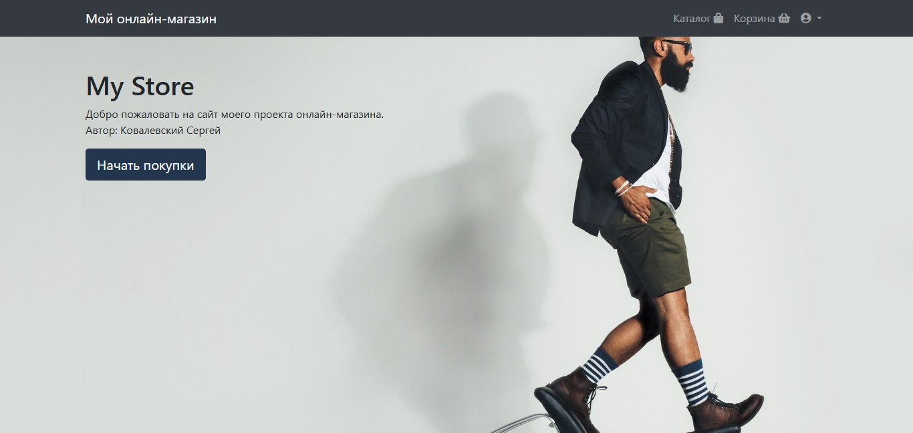

# My Store
Дипломный проект интернет-магазина, выполненный в рамках образовательной программы онлайн-университета Урбан





## Установка и запуск сервера (Windows)
1. Клонирование репозитория

```git clone https://github.com/Ser-Kov/UrbanProject```

2. Переход в директорию UrdanProject

```cd UrbanProject```

3. Установка зависимостей

```pip install -r requirements.txt```

4. Переход в директорию джанго-проекта OnlineShop

```cd OnlineShop```

5. ***Обязательно внести изменения в класс JSONRenderer фреймворка restframework***

  1) Переходим в файл views.py приложения products: OnlineShop/products/views.py
  2) На 91 линии наводим курсор на JSONRenderer() и нажимаем комбинацию Ctrl + ЛКМ
  3) В функции def render(...) меняем ```return ret.encode()``` на: ```return json.dumps(data, cls=self.encoder_class, ensure_ascii=self.ensure_ascii)```
     
6. Запускаем сервер командой ```python manage.py runserver``` и переходим по ссылке.


## Документация
Пользовательскую документацию можно получить по [этой ссылке](./docs/index.md).
